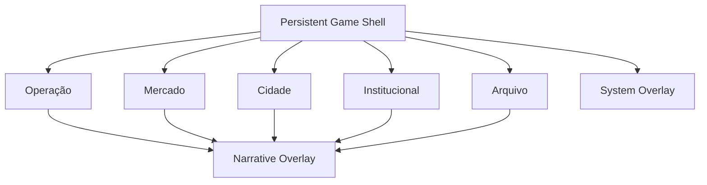

# DA LATA — Product Experience Map

**Re-baseline:** RB-01 — Product Experience Map  
**Status:** Product architecture contract  
**Target maturity:** PRESENTED product architecture contract  
**Implementation:** documentation only; no runtime behavior changes  
**Source of truth:** live repository/runtime > constitution > product re-baseline > this map > downstream RB specs

## 1. Purpose

This document defines the canonical player-facing information architecture for DA LATA before the shell and dedicated product surfaces are implemented.

It exists to prevent the current monolithic `Main` scene from becoming the permanent architecture simply because it already exposes some gameplay.

The map is intentionally implementation-agnostic. RB-02 owns the Godot shell/navigation implementation.

## 2. Verified current baseline

At the RB-01 reconciliation point:

- the canonical repository is `az1nn/growing-rio`;
- live `master` is `647687a8f10db15691ae8acefc4b08e47f8a26dc`;
- the accepted player-facing runtime is still centered on `scenes/main/main.tscn`;
- `Main` currently combines operation controls, market actions, one generic institutional action, narrative, research, log/reset and the operation diorama in one vertical surface;
- the product re-baseline remains semantically current because the default-branch commits after its original snapshot changed only repository continuation/rate-limit policy, not player-facing runtime behavior;
- the operation diorama exists as a presentation layer, but later CENA work is still carried in open stacked PRs and is not default-branch product state yet.

This map therefore treats the current `Main` as a migration source, not as the final shell.

## 3. Canonical shell model

DA LATA uses one persistent portrait-first shell with five top-level destinations:

1. **Operação**
2. **Mercado**
3. **Cidade**
4. **Institucional**
5. **Arquivo**

The shell also owns two non-destination layers:

- **Global status layer** — campaign/system state that remains visible across surfaces.
- **Overlay layer** — narrative/campaign interruptions and system overlays such as Save/Load/Settings.

Top-level navigation changes presentation context only. It never advances simulation, resolves gameplay, spends resources, changes the active district/room, completes research, or mutates campaign state by itself.

### 3.1 Global status layer

The persistent shell may summarize:

- day/cycle;
- Cash;
- Heat;
- Reputation;
- Influence;
- notification/badge state for newly available narrative/research/system items.

The shell must not become the owner of domain rules. It renders canonical state exposed by GameState/domain services.

### 3.2 Primary navigation

The primary navigation contains exactly the five canonical destinations above.

Portrait implementation should prefer a persistent bottom navigation bar. Wide layouts may adapt the same destinations to a side rail or equivalent responsive pattern, but labels, order, semantics and ownership remain invariant.

### 3.3 Overlay layer

The overlay layer is reserved for temporary context that should not become another top-level destination:

- active narrative choice;
- campaign milestone/result presentation;
- confirmation dialogs;
- Save/Load/Settings and equivalent system controls;
- destructive/reset confirmation.

Only one modal overlay may own input at a time.

## 4. Canonical surface inventory

### 4.1 Operação

**Purpose:** run the physical/business operation at the room level.

**Primary ownership:**

- active room;
- cultivation state and actions;
- room switching;
- staff;
- upgrades;
- operating-cost feedback;
- operation-local production/inventory feedback;
- operation diorama/contextual visual presentation.

**Existing playable content migrated here:**

- care;
- advance day;
- harvest;
- grow health/progress;
- inventory summary.

**Explicitly not owned here:**

- buyer/contracts decision flow;
- district selection;
- policy enactment;
- research completion;
- narrative archive.

RB-03 owns the dedicated Operation surface. RB-04 deepens rooms/staff/upgrades inside this ownership boundary.

### 4.2 Mercado

**Purpose:** convert production into business outcomes and manage buyer relationships.

**Primary ownership:**

- licensed vs abstract parallel sale decisions;
- buyer selection/presentation;
- contract board;
- active contract state;
- contract resolution;
- buyer relationships;
- market-facing price/risk/reward feedback;
- demand effects that influence a market decision.

**Cross-surface summaries:**

- selected district and demand may be summarized here;
- compliance may be summarized here when it affects a market action.

**Explicitly not owned here:**

- changing district;
- progressing compliance;
- enacting policy;
- changing rooms/staff/upgrades.

RB-05 owns this surface.

### 4.3 Cidade

**Purpose:** let the player understand and choose the fictional city context in which systems operate.

**Primary ownership:**

- district selection;
- district identity and readable state;
- district demand;
- community support;
- city-level consequences and comparative feedback.

**Cross-surface summaries:**

- market implications may be previewed;
- institutional state may be referenced when relevant.

**Explicitly not owned here:**

- contract acceptance/resolution;
- policy enactment;
- compliance progression;
- research/narrative resolution.

RB-07 owns district/demand materialization. RB-08 deepens community feedback within this surface.

### 4.4 Institucional

**Purpose:** make fictional compliance and institutional progression understandable and playable without mixing them into market ownership.

**Primary ownership:**

- compliance level/progression;
- next compliance requirement;
- fictional policy availability;
- institution level/progression;
- policy enactment;
- civic/institutional participation actions;
- abstract consequences in Cash/Influence/Reputation/Heat.

**Decision:** compliance has one primary owner: **Institucional**.

Market may display compliance summaries or warnings because compliance can affect business context, but all actions that progress compliance live in Institucional. This avoids duplicate ownership and resolves the prior Market-vs-Compliance ambiguity.

All institutional content remains fictional/systemic and non-persuasive, with no real politicians, parties, elections or targeted persuasion.

RB-06 owns compliance experience. RB-09 owns the broader institutional/policy surface.

### 4.5 Arquivo

**Purpose:** provide a persistent home for research, accumulated narrative/evidence and campaign memory.

**Primary ownership:**

- research availability and completion;
- evidence/guardrail presentation;
- completed narrative-event archive;
- resolved research history;
- campaign chronology/memory summaries when later specified.

**Narrative relationship:**

- newly available narrative choices are not resolved inside the archive by default;
- active narrative events use the global narrative overlay;
- once resolved, their persistent record belongs in Arquivo.

RB-10 owns the final Archive/Research/Narrative UX.

## 5. System-to-surface ownership matrix

| Capability | Primary owner | Secondary/global representation | Current maturity |
|---|---|---|---|
| Day/cycle | Global shell | Operação context | PRESENTED baseline |
| Cash | Global shell | Surface-local consequence previews | PRESENTED baseline |
| Heat | Global shell | Mercado/Institucional context | PRESENTED baseline |
| Reputation | Global shell | Cidade/Institucional context | PRESENTED baseline |
| Influence | Global shell | Institucional context | PRESENTED baseline |
| Cultivation actions | Operação | Global notification only | PLAYABLE |
| Active room | Operação | Global none | DOMAIN |
| Multiple rooms | Operação | Global none | DOMAIN |
| Staff | Operação | Global none | DOMAIN |
| Upgrades | Operação | Global none | DOMAIN |
| Operating costs | Operação | Global Cash impact | DOMAIN |
| Inventory | Operação | Mercado summary | PLAYABLE |
| Sale route | Mercado | Operação inventory prerequisite | PLAYABLE |
| Buyers | Mercado | None | DOMAIN |
| Contracts | Mercado | Global notification allowed | DOMAIN |
| Buyer relationships | Mercado | Narrative/campaign may read state | DOMAIN |
| Compliance | Institucional | Mercado summary/warning | DOMAIN |
| District selection | Cidade | Mercado summary | DOMAIN |
| District demand | Cidade | Mercado price context | DOMAIN |
| Community support | Cidade | Global Reputation consequence | DOMAIN |
| Institution level | Institucional | Global notification allowed | DOMAIN |
| Policies | Institucional | Cidade/Market consequence summaries | DOMAIN |
| Generic civic action | Institucional | None | PLAYABLE partial |
| Narrative availability | Global overlay queue | Arquivo badge/history | PLAYABLE |
| Narrative resolution | Global narrative overlay | Arquivo history | PLAYABLE |
| Research availability | Arquivo | Global badge | PLAYABLE |
| Research completion | Arquivo | Global badge clears/result toast | PLAYABLE |
| Save/Load/Settings | Global system overlay | None | ABSENT UX |
| Ending eligibility/selection | Frozen campaign/finale flow | Arquivo may later record outcome | DOMAIN / WATCH |

One capability has one primary player-facing owner. Secondary representations are summaries, previews, badges or history only; they must not duplicate the authoritative action.

## 6. Navigation graph



Every top-level destination is reachable in one primary-navigation action from any other top-level destination.

No major surface is nested behind another major surface.

## 7. Navigation and return-to-context semantics

### 7.1 Surface memory

During a play session, each top-level surface may retain presentation-only context such as:

- selected subpanel/tab;
- scroll position;
- expanded detail card;
- last inspected room/buyer/district/policy when that inspection does not itself mutate canonical state.

Returning to a surface restores that presentation context where practical.

Canonical gameplay selections such as `active_room_id` or `active_district_id` remain GameState/domain state, not shell memory.

### 7.2 Back behavior

Back/escape follows this order:

1. close the top modal overlay when safe;
2. close the current nested detail/subview;
3. return to the current surface root;
4. only then defer to platform-level exit behavior.

Back does not silently switch to an arbitrary previous top-level surface after reaching a surface root.

### 7.3 Navigation purity

Navigation alone must never:

- call next-day progression;
- spend Cash;
- accept/complete contracts;
- enact policy;
- alter compliance;
- resolve narrative;
- complete research;
- save/reset the campaign;
- consume RNG.

## 8. Narrative and campaign interruption model

### 8.1 Availability

When a narrative event becomes available:

- the event enters the shell's narrative queue;
- the shell displays a clear notification/badge;
- ordinary navigation remains available unless the domain explicitly exposes a future hard gate that requires resolution before a specific action;
- availability does not auto-resolve, auto-advance or mutate campaign state.

### 8.2 Opening an event

When the player opens an available event:

- it appears in the global narrative overlay above the current surface;
- the shell records the presentation return context;
- top-level navigation is temporarily suspended while the choice overlay owns input;
- only stable choice IDs exposed by canonical presentation/domain boundaries may be submitted.

### 8.3 Resolution and return

After resolution:

- semantic result feedback is shown in the overlay;
- the resolved event is recorded in Arquivo/history;
- the overlay closes back to the exact surface context from which it was opened unless a canonical campaign transition explicitly changes product context;
- a campaign transition may enqueue follow-up presentation, but may not silently duplicate state mutation in UI code.

### 8.4 Queue discipline

If more than one event/research/system notification is available:

- narrative items preserve deterministic canonical ordering from the domain;
- only one narrative overlay is active at a time;
- unresolved items remain discoverable through badge/queue state;
- research availability does not pre-empt an active narrative overlay.

## 9. Research interaction model

Research belongs to Arquivo.

When a step becomes available:

- the shell may show a badge;
- the player enters Arquivo to inspect evidence, guardrails and the research action;
- completion is submitted only through the existing canonical research boundary;
- completion result stays visible in Archive history and may produce a transient shell notification.

Research never requires the player to hunt through Operação, Mercado, Cidade or Institucional for the completion button.

## 10. System overlay contract

RB-11 will specify actual Save/Load UX, but RB-01 reserves one global system-overlay entry point for:

- Save;
- Load/Continue;
- Settings;
- campaign reset/new-cycle confirmation;
- error/corruption feedback.

System controls are not a sixth gameplay destination.

## 11. Portrait-first Web/mobile constraints

The canonical design target remains the repository's portrait-first layout.

### 11.1 Structural constraints

- five primary destinations maximum in the persistent primary navigation;
- no horizontal scrolling for primary navigation;
- each surface owns its own vertical scroll region instead of extending one application-wide infinite column;
- the global status layer remains compact and must not consume the majority of the viewport;
- critical actions remain reachable without requiring precision pointer input;
- text and controls must remain legible at the repository's mobile override target;
- modals must fit or internally scroll within the safe viewport;
- the 3D/environment layer may support a surface, but must not obscure the controls or status required to operate that surface.

### 11.2 Touch/input constraints

Implementation should target comfortable touch controls and clear focus order. RB-02 should establish reusable minimum control sizing and keyboard/gamepad focus behavior rather than solving these ad hoc in every surface.

### 11.3 Wide layouts

Wide/Desktop layouts may:

- expand content into multi-column arrangements;
- move primary navigation to a side rail;
- keep contextual detail visible beside a list.

They must not:

- create different surface ownership;
- expose gameplay actions unavailable in portrait;
- depend on hover-only interaction;
- change campaign behavior.

## 12. Diorama ownership

RB-01 does not require a unique 3D diorama for every surface.

Canonical rule:

- Operação is the first justified persistent diorama context because one already exists and directly supports the management loop;
- later surfaces may reuse, vary or omit 3D according to RB-12 evidence;
- presentation architecture must remain functional even when a surface has no dedicated 3D scene;
- RB-13 visual production happens only after shell/surface architecture is stable.

This prevents polishing temporary information architecture.

## 13. Migration from current Main

The current `Main` content migrates as follows:

| Current Main element | Target owner |
|---|---|
| Title/app identity | Shell |
| Day / Cash / Heat / Reputation / Influence | Global status layer |
| OperationDiorama | Operação presentation |
| Grow health/progress/inventory | Operação |
| Care / Advance day / Harvest | Operação |
| Licensed / parallel sale buttons | Mercado |
| Generic institutional participation | Institucional |
| Narrative panel | Global narrative overlay + Arquivo history |
| Research panel | Arquivo |
| Event log | Surface/system feedback pattern; final ownership decided in RB-02/RB-10 |
| Reset button | Global system overlay |

The migration should be incremental. RB-02 may first create the shell and route existing controls into temporary surface containers before deeper RB-03..RB-11 presentation work.

## 14. Minimum shell architecture for RB-02

RB-02 must implement at least:

- one persistent shell scene/container;
- one canonical destination identifier for each of the five surfaces;
- one primary-navigation component;
- one global-status component;
- one surface host;
- one overlay host;
- deterministic navigation state with no gameplay mutation;
- a migration path that keeps currently playable actions reachable while Main is decomposed.

RB-02 must not duplicate domain state into shell-local gameplay models.

## 15. Downstream RB constraints

### RB-02 — Game Shell / Navigation

Must implement this exact five-destination ownership model before inventing additional top-level surfaces.

### RB-03 — Operation Management Surface

Owns the dedicated operation root and moves existing cultivation flow out of monolithic Main.

### RB-04 — Rooms / Staff / Upgrades

Extends Operação; does not create a separate top-level Business destination.

### RB-05 — Market / Contracts / Buyer Relationships

Owns all buyer/contract actions and preserves district/compliance only as context summaries.

### RB-06 — Compliance Experience

Primary action ownership is Institucional. Mercado may show compliance impact only.

### RB-07 — City / District / Demand

Owns district selection/demand visualization.

### RB-08 — Community Feedback

Lives primarily inside Cidade and feeds global Reputation only through canonical domain state.

### RB-09 — Policy / Institutional

Completes Institucional around policy/institution progression.

### RB-10 — Archive / Research / Narrative UX

Moves research to Arquivo and formalizes narrative history while keeping active choices in the global overlay.

### RB-11 — Save / Load / Campaign UX

Uses the global system overlay rather than a gameplay destination.

### RB-12 — Diorama Scene System

May attach contextual visual scenes to surface identities without changing ownership/navigation semantics.

### RB-13 — Visual Production Pass

Polishes only architecture that survived RB-02..RB-12.

### RB-14 — Campaign Progression Revalidation

Must replay progression through these surfaced systems and verify that campaign gates now correspond to meaningful player action.

### RB-15 — Resume Finale

Remains frozen until RB-14 PASS/unfreeze. Finale presentation must integrate with the shell without adding a permanent sixth destination unless a later accepted product decision supersedes this map.

## 16. Product acceptance checklist

RB-01 is accepted when all are true:

- [x] every re-baseline capability has one primary player-facing owner or explicit global-layer ownership;
- [x] the five major destinations are named and bounded;
- [x] global status vs local surface state is explicit;
- [x] navigation does not own gameplay mutation;
- [x] return-to-context behavior is defined;
- [x] narrative availability, overlay, queue and return behavior are defined;
- [x] research ownership is defined;
- [x] compliance ownership ambiguity is resolved;
- [x] portrait and wide-layout invariants are defined;
- [x] the current Main migration is mapped;
- [x] RB-02..RB-15 can consume this contract without redefining the top-level architecture.

## 17. Non-goals

RB-01 does not:

- implement the shell in Godot;
- change gameplay/domain behavior;
- change save schema;
- change balance;
- add assets;
- deepen finale logic;
- change canon;
- allocate permanent post-008 feature numbering.

## 18. Result

The canonical player experience is no longer “one long Main screen.”

It is:

```text
Persistent Shell
├─ Global status
├─ Operação
├─ Mercado
├─ Cidade
├─ Institucional
├─ Arquivo
└─ Overlay layer
   ├─ Narrative / campaign
   └─ System (Save / Load / Settings / confirmation)
```

This is the product architecture input for RB-02.
