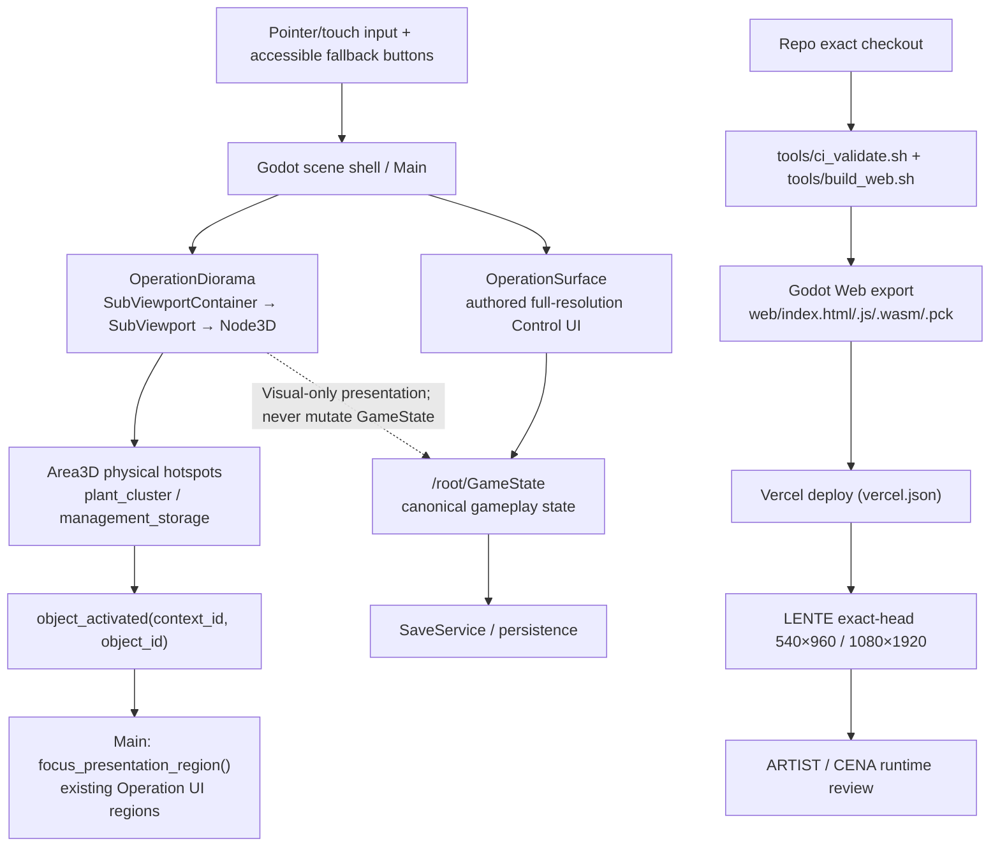
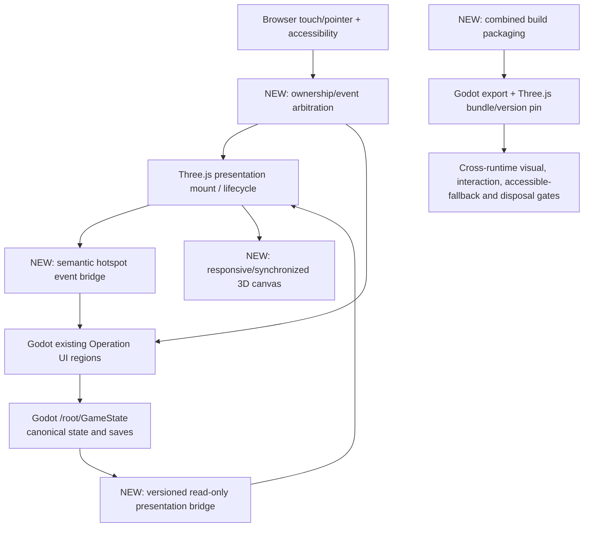

# T012 — Operation V1 renderer integration contract

**Captured baseline:** `master` after PR #190 / Feature 011. **Purpose:** compare **one** production 3D renderer with an optional Three.js production bridge, without prejudging the T015 decision. **Approved visual target:** `operation-concept-acceptance.md`.

## As shipped now: one Godot runtime

Verified ownership: `scenes/visual/operation_diorama.gd` signals the 3D-only `plant_cluster` and `management_storage` selections and exposes mouse/touch + accessible button fallbacks. `scenes/main/main.gd` consumes `object_activated` and focuses the preexisting cultivation/management presentation; mutations stay behind authored `scenes/operation/operation_surface.gd` and `/root/GameState`. This is an **existing implementation contract**, not a claim that the accepted ARTIST V1 appearance is already shipped.

## If Three.js were selected for production

`threejs/operation-diorama/src/main.js` currently owns only an isolated WebGL renderer, resize and disposal; `presentationModel.js` is a static scene/camera model. It does **not** currently bridge Godot canonical state, scene navigation, input arbitration, accessible fallback or shipped Vercel packaging. Those would be additional production features, not free reuse of the prototype. Source-side references remain under `threejs/*` unless T015 explicitly selects Three.js.

## Decision evidence inventory

| Ownership concern | Existing Godot path | Additional Three.js production obligation | How to verify |
| --- | --- | --- | --- |
| Canonical state and saves | `autoload/game_state.gd`; `autoload/save_service.gd` | Read-only state bridge; mutation routing back to Godot only | No duplicate state mutation in semantic hotspot tests |
| Touch and pointer | `Area3D` + `SubViewport.physics_object_picking` | Pointer ownership, raycasting, event propagation and focus arbitration | Tap tests at both portrait widths |
| Accessibility | Existing authored Godot buttons and regions | Mirror semantic focus/fallbacks in composite web UI | Button fallback tests and actual device checks |
| Responsive composition | Godot SubViewport + authored UI | Synchronize WebGL canvas CSS pixels and Godot UI safe zone | Exact-head 540×960 and 1080×1920 screenshots |
| Disposal/navigation | Godot scene lifecycle | Three.js renderer mount, resize and explicit disposal on every route | Mount/unmount resource regression |
| Build/deploy | `vercel.json` calls `ci_validate.sh` then `build_web.sh`; `web/` is the exact-head Godot export | Additional bundle, versioned bridge and combined provenance | Rebuild published pack and compare exact HEAD metadata |
| V1 visual quality | New pixel/graffiti material pipeline needed | Same authored V1 asset layer plus integration | T013 bounded material spike + LENTE comparison |
| Performance | Measure Godot Web baseline | Measure combined resident runtimes and texture budgets | T014 browser measurements, not inferred budget |

## Bounded spike and rollback

- **T010:** capture exact-head Godot Operation in the two portrait targets. Keep existing runtime UI/game state untouched and use the independently accepted Operation concept as visual target.
- **T011:** capture isolated Three.js Operation/Grow Room reference at the same viewport targets; label as non-shipped reference.
- **T013:** test one scene-only pixel-resolution/material treatment, one graffiti surface and one workbench-like primary prop. Do not build the entire scene twice. Existing gameplay interactions and full-resolution UI remain canonical.
- **T014:** persist artifact paths, exact 40-char SHAs, per-path metrics and limitations; do not describe missing Vercel previews as passing.
- **T015:** lock the production-renderer decision in `renderer-decision.md` only after evidence; retain Three.js prototype lane until then.

## Open work / explicit nonclaims

The Operation concept is accepted **as art**, not rendered 1:1 yet. No T010/T011 exact-head comparison or T013 measured spike is established by this architecture document. Runtime acceptance still requires the separate LENTE + human CENA/ARTIST gate.
